# Pizzeria Application

This repository contains two web applications with a shared backend for managing pizza orders. The first application is for customers to order pizzas, and the second is for pizzeria employees to manage orders and update the available menu options.

## Features

### Customer Application:
- **Anonymous Users**: Customers can view available pizza options and place orders without needing to log in.
- **Pre-configured or Custom Pizzas**: Customers can choose from a variety of pre-configured pizza options or create their own pizzas by selecting different toppings.

### Employee Application:
- **Registered Users**: Employees can log in to manage customer orders.
- **Order Processing**: Employees can view, update, and mark customer orders as complete.
- **Menu Management**: Employees can add, update, or remove pizza options from the menu.

## Technologies Used

### Backend: 
- **Java**: The core language used to build the backend application.
- **Spring Boot**: A framework that simplifies the development of Java-based web applications. Spring Boot was used to build the backend RESTful API to manage orders and pizzas.
- **PostgreSQL**: A relational database management system used for storing customer orders, pizza options, and employee information.

### Frontend:
- **Vue.js**: A JavaScript framework used for building the user interfaces for both the customer and employee applications. Vue enables reactive, dynamic frontends with easy data binding and component-based architecture.
- **JavaScript**: Used to handle client-side logic, enabling smooth user interactions within the applications.

### Tools & Additional Technologies:
- **HTML**: Provides the structure of the web pages for both the customer and employee interfaces.
- **CSS**: Used for styling the applications, ensuring a clean and responsive user interface.
- **Postman**: A tool used for testing the backend API endpoints during development to ensure correct data retrieval and submission.

## Visual Demos
### Customer Previews:

**Home Page**
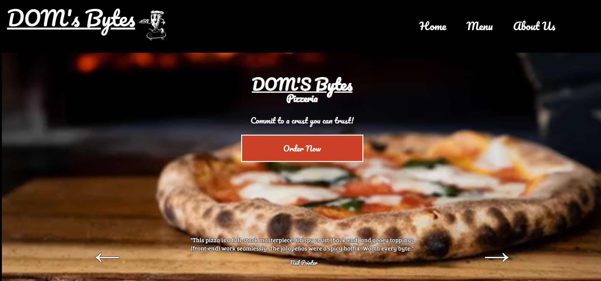

**About Us**
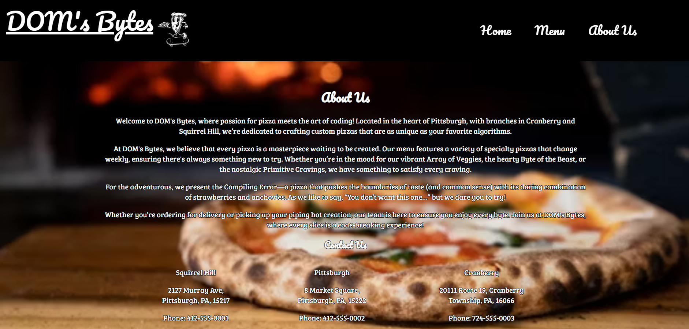

**Menu PDF**
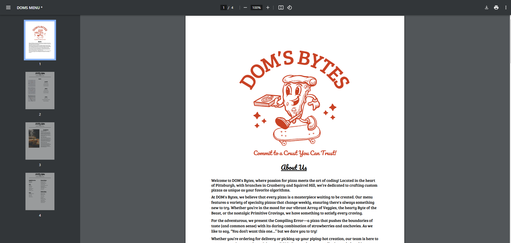

**Order Specialty Pizza**
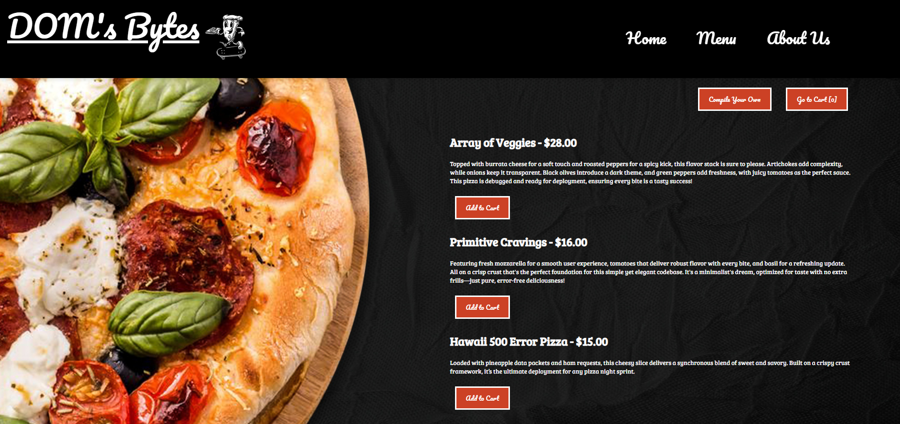

**Order Custom Pizza**
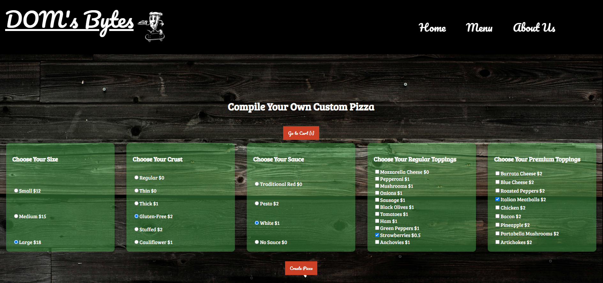

**Cart & Enter Customer Information**
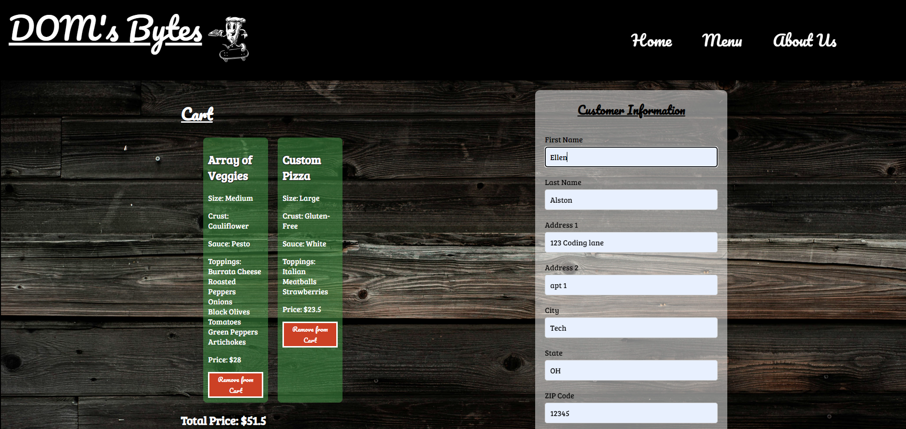

**Cart & Enter Order Information**
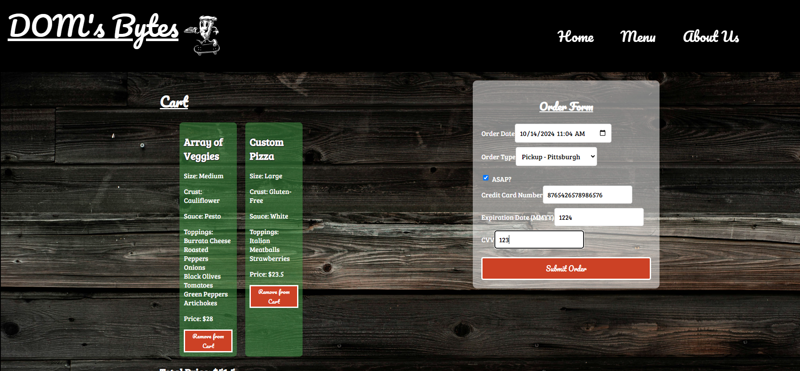

**Order Confirmation**
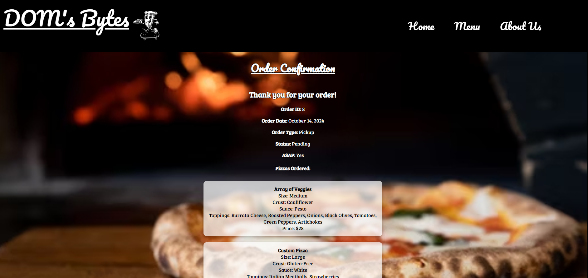

## Employee Previews

**Employee Login**
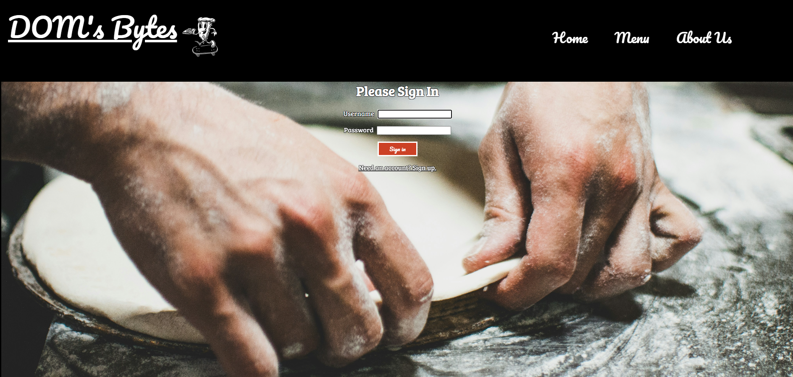

**Employee Home Page**
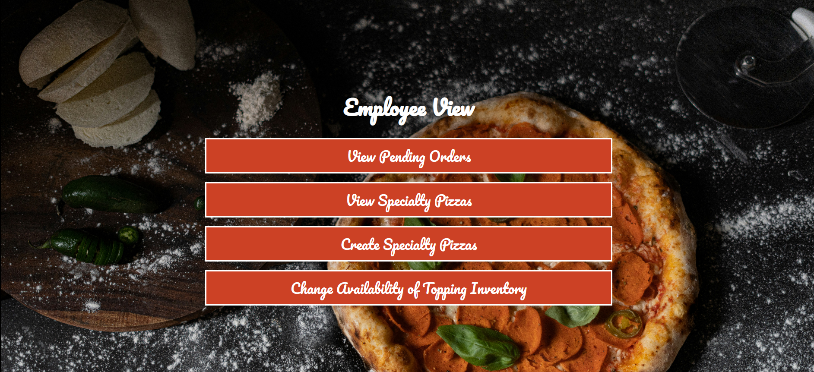

**View Orders**

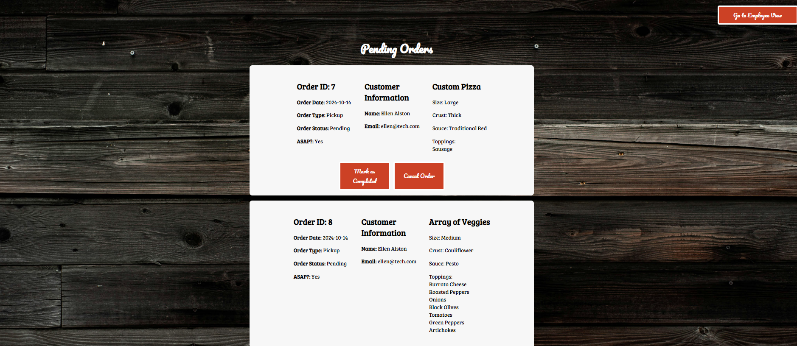

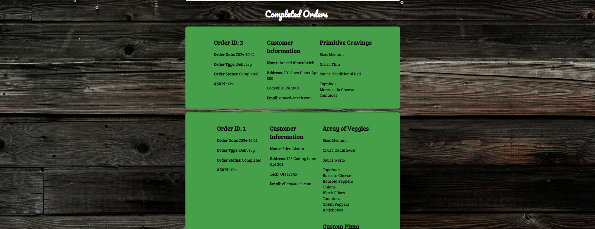

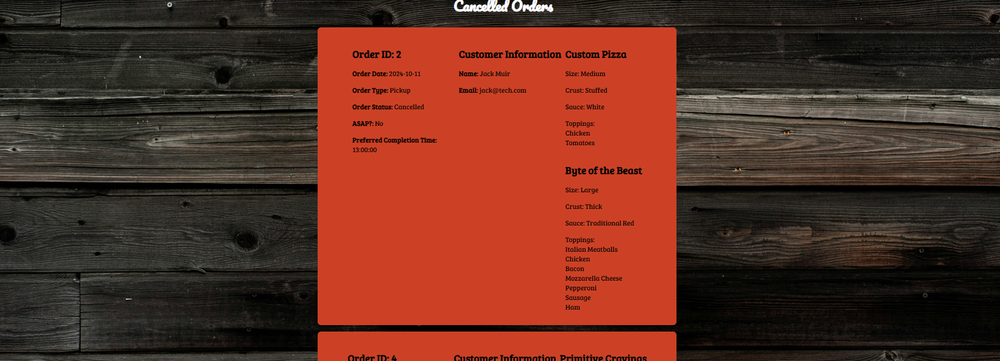

**View All Specialty Pizzas**
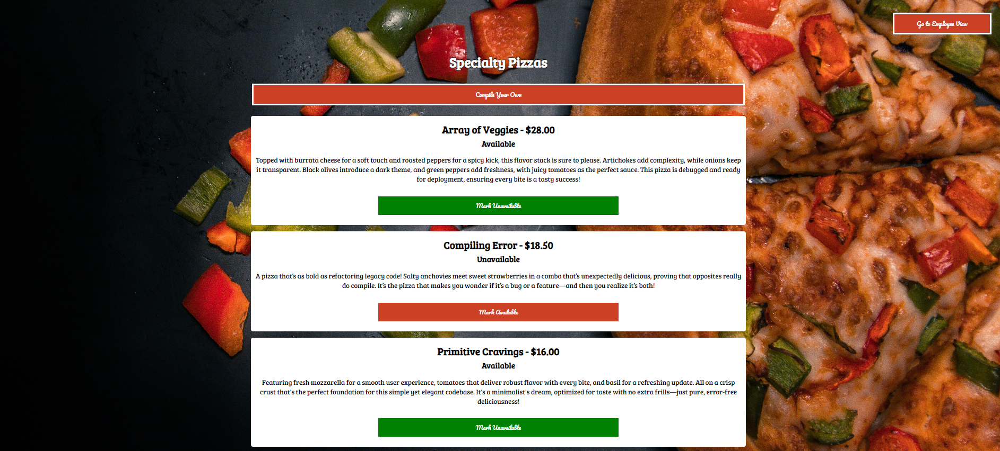

**Create a New Specialty Pizza**
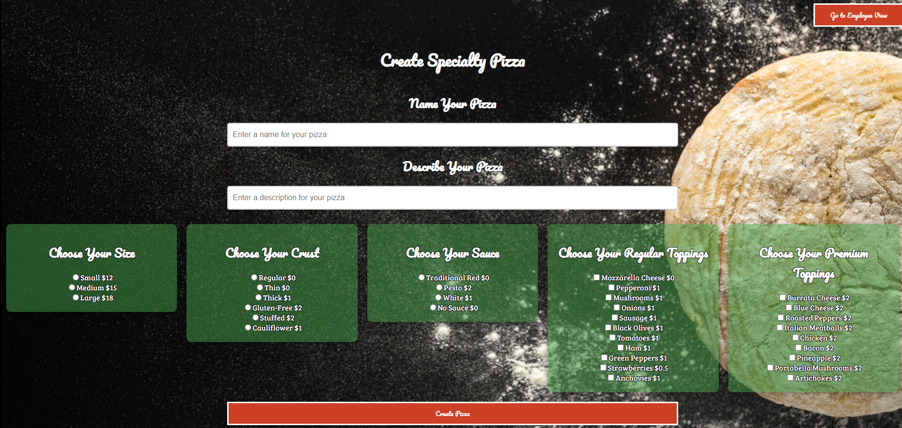

**Change Topping Availability**
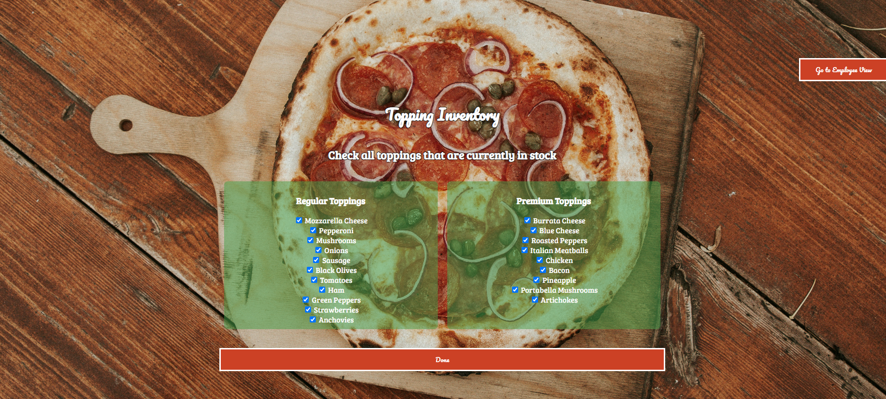

